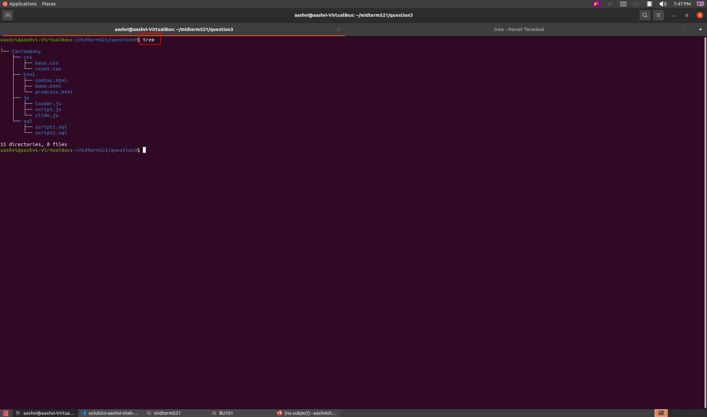
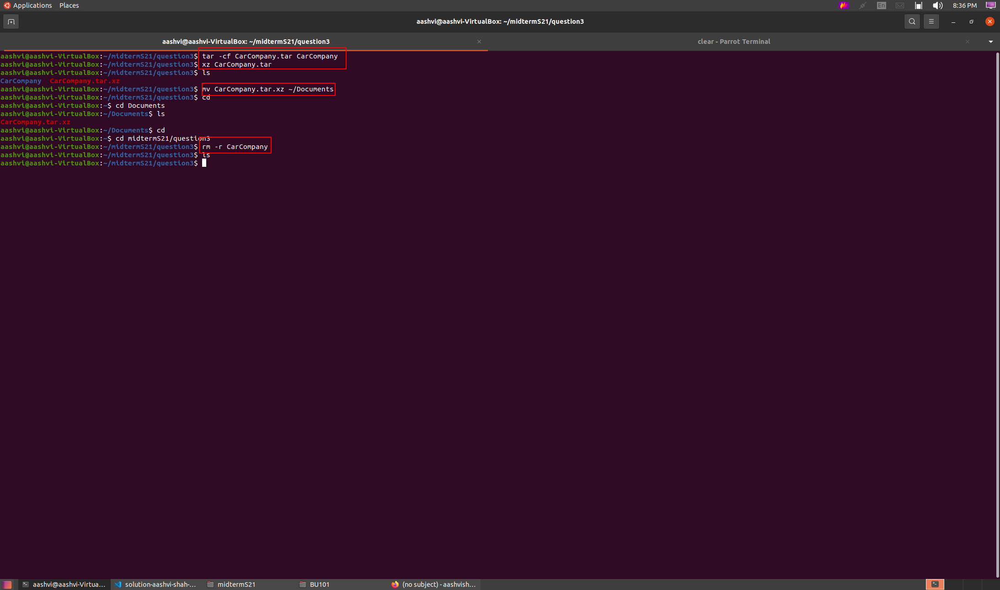

* Name: **Aashvi Shah**
* Semester: **Spring 2019**

# Midterm Spring 2021

## Question 1
**Ubuntu is a free operating system, so there is no monetary investment required. It is a smart idea for the lab to upgrade to Ubuntu rather than purchasing new computers. The speed of current computers can be poor attributed to the reason that they have old processor. Ubuntu is well-known for its lightning-fast speed and excellent security safety. Hackers would find it difficult to gain access to your machines. From the moment you install Ubuntu, you will make it your own as it is customizable. The requirement for Ubuntu to work finely is RAM of a computer. The computer in the lab carries 2gb of RAM, which fits pretty fine to work with Ubuntu. Applications like c++, python, and web development need a lot of space, which Linux can easily provide. It's also simple to expand the available capacity by adding more disk space. Ubuntu is very convenient to use as it is user-friendly. For all this reasons, I can say that it is better to switch to Ubuntu rather than spending money in upgrading the machines.**

## Question 2

## Question 3

## Question 4

## Question 5

## Question 6

## Question 7

## Question 8

## Question 9 

## Question 10
1. Which was the hardest question? Why?
  
   **According to me the hardest question was question 4 because i found it complicated to organize those files.**
2. Which was the easiest question? Why?
  
    **The easiest question was question 2, as it was easy to create directories and organizing files into respective directories.** 
3. What could have made this midterm easier?
  
   **less complicated questions or provided more info have made this midterm easier**
   
4. On a scale from 1 to 5 (1 meaning nothing at all and 5 meaning a lot more than you thought), how much have you learned about Linux?
 
 **5, because linux was just an OS for me before this class, now i know a lot more things about linux**
5. In your opinion, do you think this format of the examination is better or worse than the traditional exams? A
traditional exam is in the form of true or false questions and selects the right answer or short explanations
**in my opinion this format is way better than traditional examination because we learn a lot more in this format whereas in traditional examination format one cannot learn a lot they can only have theoretical knowledge instead of practical knowledge.**